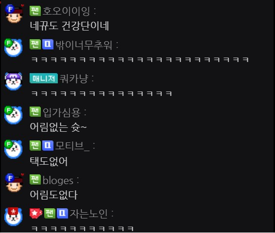
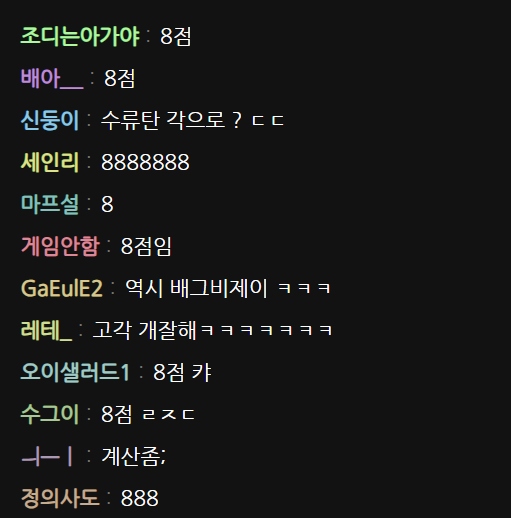

# 아프리카 채팅창 디자인 변경 크롬 익스텐션

이 크롬 익스텐션은 아프리카TV 채팅창의 디자인을 변경하는 기능을 제공합니다.

## 기능

1. 채팅창 레이아웃 변경
   -> 기존의 닉네임과 채팅창으로 두줄로 출력 되던걸 1줄 출력 으로 전환
   -> 공지는 기존의 디자인을 유지 하도록 함.
   ->

2. 채팅창 내의 이모티콘(매니자,열혈팬,퀵뷰이용자 등) 표기 X

3. 채팅창 닉네임 에 색상 랜덤 변경

## 설치 방법

1. github 에서 zip 파일로 다운로드.
2. Google Chrome 웹 브라우저를 엽니다.
3. 확장 프로그램 관리로 이동.
4. 개발자 모드 ON.
5. 압축해제된 확장 프로그램 로드합니다 클릭.
6. 자동 적용
<!-- 3. 'AfreecaTV Chat Redesign Extension'을 검색하여 찾습니다.
7. '추가' 버튼을 클릭하여 익스텐션을 설치합니다. -->

## 사용 방법

1. 아프리카TV 웹사이트를 방문합니다.
<!-- 2. 채팅창 옆에 나타나는 익스텐션 아이콘을 클릭합니다.
2. 원하는 디자인을 선택하여 적용합니다. -->

## 기여 방법

1. 이 프로젝트의 GitHub 레포지토리를 포크합니다.
2. 개선하거나 추가하고 싶은 기능에 대한 브랜치를 생성합니다.
3. 변경 사항을 커밋하고 브랜치를 GitHub에 푸시합니다.
4. 풀 리퀘스트를 생성합니다.

<!-- ## 라이센스 -->

<!-- 이 프로젝트는 MIT 라이센스에 따라 라이선스가 부여됩니다. 자세한 내용은 'LICENSE' 파일을 참조하세요. -->

## 버그 리포트

1. 채팅창 에 이모티콘 이 제대로 출력 되지 않음
2. 다크 모드에 따른 글자 색상 변경 이 제대로 이루어지지 않음.
3. 공지 의 출력이 제대로 이루어지지 않아서 가독성을 해침
4. 다크 모드에 서 닉네임의 색상이 조절을 하지 않아 가독성이 떨어짐
   ex) 다크 모드 일때 어두운 색상이 면 제대로 보이지 않음

## 작성자 정보

- 이름: [이성석]
- 이메일: [togussla@naver.com]
- GitHub: [https://github.com/seong-94]
